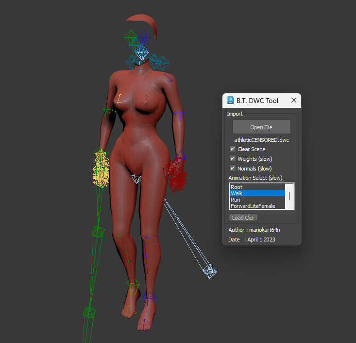

# Bone Town Mesh Importer for 3ds Max

## Overview
This MaxScript is designed for importing Bone Town mesh files into Autodesk 3ds Max, specifically targeting various versions of the DTS (Dynamix Three Space) model format. It supports multiple mesh format variants identified within the game.

## Features
- **Importing Capability:** Supports importing DTS files with multiple mesh format variants (Versions: 24, 25, 27, 29).
- **Animation Loading:** Load and manage animations associated with the imported meshes.
- **Flexible Scene Management:** Options to clear the scene before importing and manage vertex weights and normals.
- **User Interface:** A simple dialog interface to select files and manage import options.

## Requirements
- Autodesk 3ds Max 2010 or later.
- Basic knowledge of MaxScript and 3ds Max.

## Installation
1. Open Autodesk 3ds Max.
2. Copy the MaxScript code into the MaxScript editor.
3. Run the script to display the import dialog.

## Usage
1. Click the **Open File** button to select a DTS, DWC, or DTM file to import.
2. Optionally check the **Clear Scene** box to remove existing objects from the scene before import.
3. Use the **Weights** and **Normals** options for advanced importing (these may slow down the process).
4. Load animations using the **Load Clip** button after selecting an animation from the list.
5. Click **Import** to finalize the import process.

## Disclaimer
This software is provided "as is" without any warranties or guarantees, express or implied. The author is not liable for any damages arising from the use or inability to use this software.
